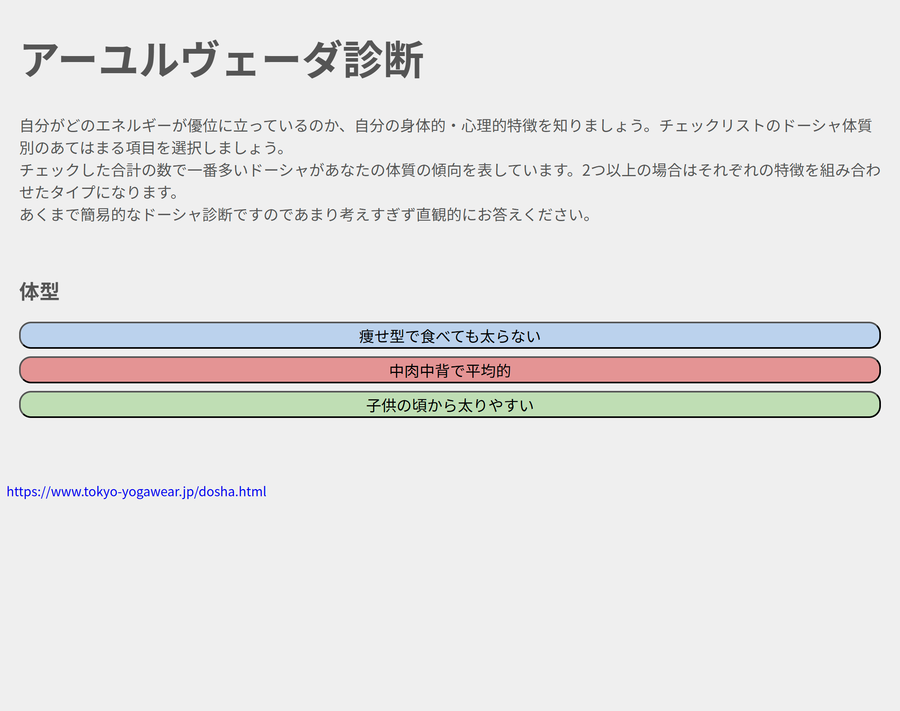
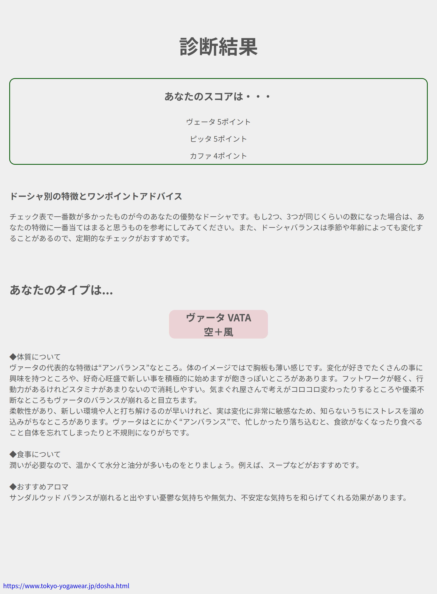
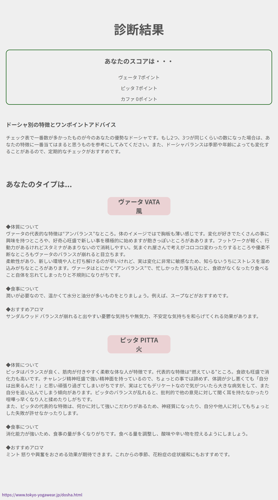

# JavaScript クイズゲーム（js_QAgame_2）

## 概要

HTML / CSS / JavaScript（Vanilla JS）で作成したクイズゲームです。  
選択肢から回答を選ぶと正誤判定が行われ、スコアが加算されます。  
DOM 操作やイベント処理など、JavaScript の基本的な仕組みを用いて実装しています。

---

## 使用技術

### Frontend

- HTML5
- CSS3
- JavaScript（Vanilla JS）

### JavaScript ロジック

- DOM 操作（`querySelector`, `textContent`, `innerHTML` など）
- イベントハンドリング（クリックイベント）
- 状態管理（現在の問題番号、スコア、ゲーム進行）
- 配列データによる問題管理
- 条件分岐・ループ処理
- UI の動的レンダリング

---

## 機能一覧

- クイズの出題（複数問題を配列で管理）
- 選択肢クリックによる正誤判定
- スコア加算
- 次の問題への自動遷移
- 最終スコアの表示
- ゲームのリスタート

---

## 画面イメージ

